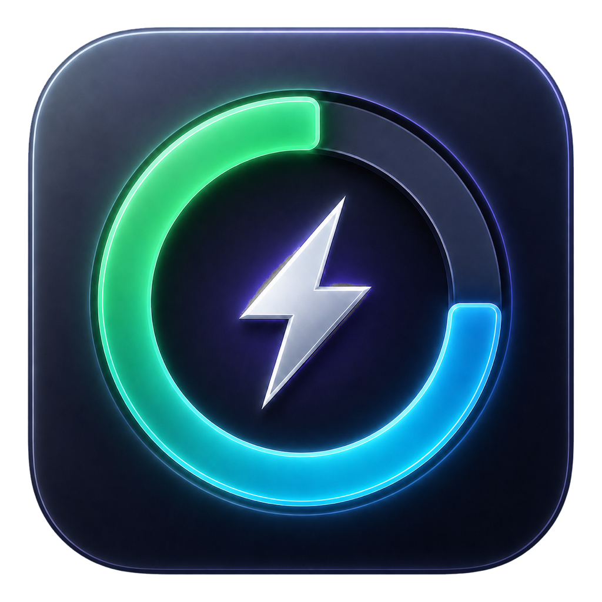

# CodexMeter

<p align="center">
  
</p>

CodexMeter is a native macOS menu bar app that shows the remaining quota reported by the locally installed OpenAI Codex CLI. It uses Swift, SwiftUI, and `MenuBarExtra`, stays out of the Dock, and refreshes without asking users to paste a token.

## Features

- Compact, always-visible menu bar remaining percentage such as `Codex 64%`.
- Reset countdowns in the dashboard and widgets use days, hours, and minutes, such as `3d2h5m`.
- Multiple quota windows, including five-hour, weekly, and model-specific limits.
- Current Codex account type, masked account email, plan, and configured model.
- Manual refresh and a low-CPU automatic refresh loop that defaults to 60 seconds.
- macOS notifications at 50%, 30%, and 10% remaining, deduplicated per quota cycle.
- Native Dark Mode, Reduce Motion, and VoiceOver support.
- Last-known-good data remains visible during temporary failures.
- Native small and medium WidgetKit widgets for Notification Center and the macOS desktop.
- Provider boundaries for future OpenAI API, Claude Code, Cursor, Gemini CLI, and GitHub Copilot integrations.

## Requirements

- macOS 13 Ventura or later.
- macOS 14 Sonoma or later to place the widget on the desktop. On macOS 13, the widget is available in Notification Center.
- An installed Codex CLI available in `PATH`, `/opt/homebrew/bin`, `/usr/local/bin`, `~/.local/bin`, or `~/.volta/bin`.
- A Codex CLI account that has completed the normal Codex sign-in flow.
- Swift 5.9 or later to build from source.

CodexMeter never asks for an API key or ChatGPT token.

## Install from GitHub

On an Apple Silicon Mac, install the latest release directly from GitHub:

```bash
curl -fsSL https://raw.githubusercontent.com/LAwLi3tCoding/CodexMeter/main/scripts/install.sh | zsh
```

The installer downloads the matching GitHub Release asset and SHA-256 file, verifies the checksum and app signature, and installs `CodexMeter.app` into `/Applications` when writable or `~/Applications` otherwise. It does not require `sudo`, an API key, or a source checkout.

To install a specific release or choose the destination:

```bash
curl -fsSL https://raw.githubusercontent.com/LAwLi3tCoding/CodexMeter/main/scripts/install.sh \
  | CODEXMETER_VERSION=v0.1.0 CODEXMETER_INSTALL_DIR="$HOME/Applications" zsh
```

Then launch CodexMeter:

```bash
open /Applications/CodexMeter.app
```

Launch the containing app once so macOS can discover its widget extension. On macOS 14 or later, Control-click the desktop, choose **Edit Widgets**, search for **CodexMeter**, then add the small or medium widget. The same widget can be added to Notification Center on macOS 13 or later.

Version 0.1.0 provides an Apple Silicon (`arm64`) binary. Intel Macs can build a native binary from source.

## Build from source

```bash
git clone https://github.com/LAwLi3tCoding/CodexMeter.git
cd CodexMeter
./scripts/build-app.sh
open build/CodexMeter.app
```

The script builds the menu app and native WidgetKit extension, embeds `CodexMeterWidget.appex`, validates both property lists, signs the nested extension first, and applies an ad-hoc local signature to the containing app. Move the app to `/Applications` if desired.

For a debug bundle:

```bash
./scripts/build-app.sh debug
```

## How quota access works

CodexMeter launches one long-lived local helper process:

```text
codex app-server --listen stdio://
```

It initializes the documented newline-delimited App Server protocol and uses these read methods:

- `account/read` for the active account type, email, and plan;
- `account/rateLimits/read` for quota windows, usage percentages, and reset times;
- `config/read` for the effective configured model.

The app decodes only the fields it needs, ignores unknown response fields, drains helper stderr without storing it, and never reads `~/.codex/auth.json`, Keychain tokens, Codex SQLite data, or private ChatGPT HTTP endpoints. Account responses and effective configuration are never logged.

Subscription resolution trims blank values and prefers the root quota response, then the canonical `codex` quota bucket, then a plan shared by every other quota bucket. It falls back to account metadata when quota plans are absent or conflicting. The Codex `pro` quota tier is displayed as `PRO 20X`.

`usedPercent` is converted to remaining percentage with `100 - usedPercent`. A value such as `3d2h5m` is the time until that quota window resets; it is not a guaranteed amount of model runtime. The protocol does not provide a reliable remaining-message count.

## Desktop widget refresh behavior

The running menu-bar app continues reading Codex quota data every 60 seconds. After a successful refresh it atomically writes a privacy-minimal snapshot to `~/Library/Application Support/CodexMeter/` and requests a WidgetKit timeline reload. The sandboxed widget has read-only access to that directory; it never starts Codex CLI, reads Keychain, or calls a remote API.

WidgetKit controls the final refresh schedule and may delay or coalesce reload requests. CodexMeter therefore advances countdowns with five-minute timeline entries, shows when its snapshot was updated, and marks data stale after 15 minutes. This is a system-scheduled status widget, not a guaranteed one-minute timer. See Apple's [WidgetKit update guidance](https://developer.apple.com/documentation/widgetkit/keeping-a-widget-up-to-date/) for the platform behavior.

See [the data-source research](docs/research/codex-quota-data-source.md) and [the architecture design](docs/superpowers/specs/2026-07-13-codexmeter-design.md) for details.

## Architecture

```text
CodexMeter
├── Sources/CodexMeterApp
│   ├── App                 SwiftUI app lifecycle and composition
│   ├── MenuBar             Menu bar label
│   ├── Services            Widget snapshot publication bridge
│   └── UI                  Header, cards, states, and controls
├── Sources/CodexMeterCore
│   ├── Models              Quota and presentation models
│   ├── Providers           Codex and future provider boundaries
│   ├── Services            App Server transport and notifications
│   ├── State               Main-actor refresh store
│   ├── Storage             UserDefaults settings and alert state
│   └── Support             Formatting helpers
├── Sources/CodexMeterWidget
│   ├── TimelineProvider    Read-only shared snapshot timeline
│   └── SwiftUI             Small and medium widget layouts
├── Tests/CodexMeterTests   Dependency-free executable test harness
├── Resources               Bundle metadata
└── scripts                 App bundle assembly
```

Views render immutable presentation data and call `QuotaStore` actions. Provider and protocol logic stays in `CodexMeterCore`. `CodexProvider` prefers `rateLimitsByLimitId` and uses the compatibility `rateLimits` value only when the multi-bucket response is absent.

## Development

Run all deterministic tests:

```bash
swift run CodexMeterTests
```

Run the optional integration smoke test against the installed, signed-in Codex CLI:

```bash
swift run CodexMeterTests --suite live
```

Build with compiler warnings treated as errors:

```bash
swift build -Xswiftc -warnings-as-errors
```

Compile the widget as an app-extension-safe product and validate its assembled bundle:

```bash
swift build --product CodexMeterWidget \
  -Xswiftc -application-extension \
  -Xswiftc -warnings-as-errors
zsh Tests/Scripts/WidgetBundleTests.sh
```

The executable test harness keeps local development compatible with Apple Command Line Tools installations that do not include XCTest or the Swift Testing module.

## Privacy and distribution

- No credentials are stored by CodexMeter.
- Settings contain only refresh preferences and notification-cycle state.
- The widget snapshot contains only provider, top-level model, update time, and quota `id`, `label`, `model`, remaining percentage, reset time, and window duration. It excludes account identifiers, plan metadata, and credentials.
- Account identifiers are masked in the UI and are not stored in plaintext notification keys.
- Notification permission denial never blocks quota display.
- App Sandbox is intentionally disabled for the containing menu app because it must locate and launch the user-installed Codex executable. The WidgetKit extension is sandboxed and receives only a read-only file exception for CodexMeter's Application Support directory.

GitHub Release builds are currently ad-hoc signed and checksum-verified, but not signed with an Apple Developer ID or notarized by Apple. macOS may therefore ask for confirmation on first launch. Developer ID signing and notarization are planned for a smoother trust experience. The widget's narrow temporary file exception supports direct GitHub distribution but is not suitable for Mac App Store submission.

## Current limitations

- ChatGPT Codex rate limits are displayed only when the installed CLI exposes them.
- API-key accounts are identified, but OpenAI API billing and organization limits are not implemented.
- Usage history and charts are planned extension points, not part of version 0.1.0.
- Notifications require launching the assembled `.app` bundle so macOS has a bundle identity.
- Widget updates are scheduled by macOS and cannot guarantee the menu app's one-minute refresh interval.

## Contributing

See [CONTRIBUTING.md](CONTRIBUTING.md). By contributing, you agree that your changes are licensed under the project license.

## License

CodexMeter is available under the [MIT License](LICENSE).
